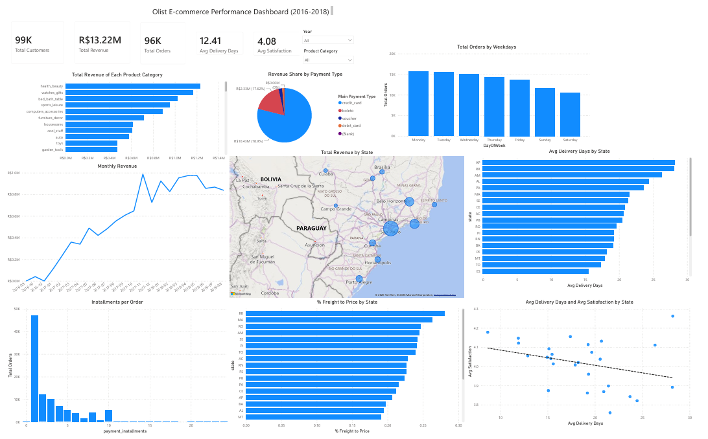
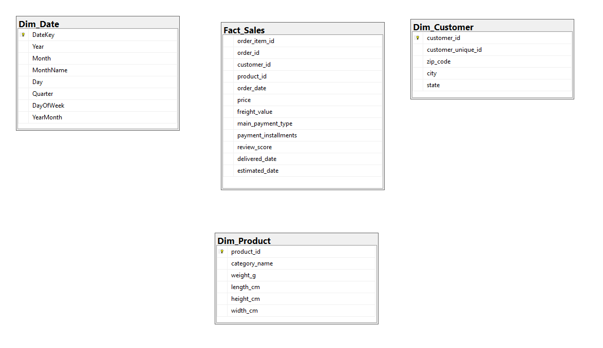

# E-Commerce Business Intelligence
 
**Course:** Business Intelligence  
**Class:** E22HTTT  
**Group:** 6  
**Members:** Nguyễn Tuấn Minh (B22DCKH077) & Nguyễn Xuân Kiên (B22DCKH062)

## Dashboard Preview

  <!-- Hãy upload ảnh dashboard.png của bạn vào thư mục images trên repo -->
  

## Dataset

Raw data: [Brazilian E-Commerce Public Dataset by Olist](https://www.kaggle.com/datasets/olistbr/brazilian-ecommerce) (Kaggle). It represents nearly 100,000 delivered orders placed between 2016 and 2018.

| File | Description |
| :--- | :--- |
| `olist_orders_dataset.csv` | Order-level data (status, purchase & delivery timestamps) |
| `olist_order_items_dataset.csv` | Line-item data per order (product, price, freight) |
| `olist_customers_dataset.csv` | Customer demographic info (ID, city, state, zip) |
| `olist_products_dataset.csv` | Product metadata (category, weight, dimensions) |
| `olist_order_payments_dataset.csv` | Payment type and installment details |
| `olist_order_reviews_dataset.csv` | Customer review scores (1-5 stars) |
| `product_category_name_translation.csv` | Portuguese → English category name mapping |

---

## Data Warehouse Schema (Star Schema)

The data warehouse uses a **Star Schema** design for optimal query performance and analytical simplicity within Power BI.

  <!-- Hãy upload ảnh erd.png của bạn vào thư mục images trên repo -->
  

